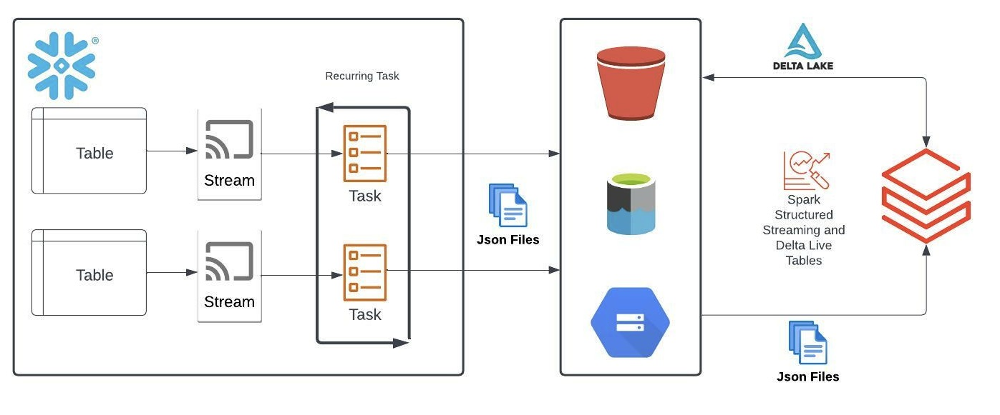
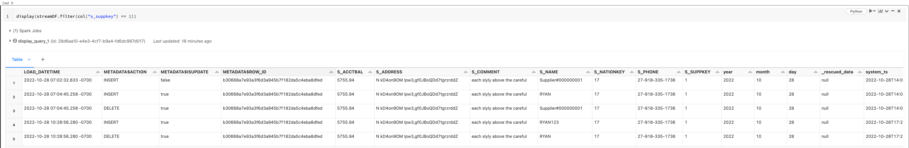

# Snowflake Stream Reader

The Snowflake Stream Reader is used to ingest data from Snowflake in a cdc fashion. Users can configure a schedule cadence in which Snowflake change data (via Snowflake Streams) is exported as JSON files to cloud storage. At that point the project uses Databricks Auto Loader to ingest the data into delta. 

Developers can read this change data as an append only stream or they can leverage the built in merge functionality to replicate the table from Snowflake to Delta. The basic ask is to provide a framework to read Snowflake data as a stream. This library can also be used in a metadata application that can dynamically manage all ingestion using Delta Live Tables. See [DLTPipeline.py](./docs/samples/DLTPipeline.py)

The high level process can be described with the visual below. Please note that the process between Snowflake and Databricks is decoupled, meaning that if the Databricks stream is cancelled then Snowflake will continue publishing JSON files to cloud storage unless the associated task is explicitly suspended.  



## Installing 
This library is intended to only be used with the Databricks runtime and was developed on DBR 10.4 LTS. It is recommned to use DBR 10.4+ but may work on older runtimes as well. **This repository is intended to be a demo on how to efficiently get data out of Snowflake and is not necessarily for production use.**  

Currently users must install from this repository. To do so, run `pip install git+https://github.com/rchynoweth/SnowflakeStreamReader.git@main`. 

Once installed, you can connect to Snowflake as a stream with the code below, please see [run_example.py](./docs/samples/run_example.py) for a full notebook. 


Required Parameters:
- snowflake_database: the database to which namespace objects (file format, stages, etc) are created in. 
- snowflake_schema: the schema to which namespace objects (file format, stages, etc) are created in. 
- stage_name: created if it does not exist 
- file_format_name: created if does not exist 
- file_format_type: must be `json` at this time. 
- tables: json list of tables to load from Snowflake

Optional Namespace Parameters: 
- s3_bucket: aws only
- storage_account_name: azure only
- container_name: azure only
- sas_token: optional and azure only
- storage_integration: required for aws and optional for azure. If provided then this will be used over the sas_token. 
- additional_path: path suffix for sub-directorys in the bucket/container 

Optional Table Parameters:
- enabled: default to true 
- merge_keys: if they are not provided then append only streams are supported but not able to perform merges 


```python
from snowflake_cdc.snowflake_stream_reader import SnowflakeStreamReader

config = {
 'file_format_name':'file_format_name', 
 'sas_token':'sas_token', #optional, Azure only. Can also provide an existing storage integration name using `storage_integration` option. 
 'stage_name':'snowflake_stage',
 'storage_account_name':'storage_account_name',
 'container_name':'container_name',
 'snowflake_database':'snowflake_database', # database to create stage and file format
 'snowflake_schema':'snowflake_schema', # schema to create stage and file format 
 'additional_path':'stage_path', # optional path for data in storage
 'database_name':"table_database", # database the table belongs to
 'schema_name':"table_schema", # schema the table belongs to 
 'table_name':"table_name", 
 'merge_keys':['id'], 
 'snowflake_user': 'SF Username',
 'snowflake_password': 'SF Password',
 'snowflake_account': 'snowflake_account'
}

# create reader object 
snowflakeStreamer = SnowflakeStreamReader(spark, dbutils)

# instantiate a streaming DF
streamDF = snowflakeStreamer.read_snowflake_stream(config)

# display data 
display(streamDF)
```


### Data Layout

The layout of data in cloud storage is pre-determined and is parameterized by the user. In this examples we will use an Azure storage account, it is important to note that S3 and GCS will map to the container in Azure.  

Data is published in the following format: 
- Storage Account Name: `storage_account_name`
- Container Name: `container_name`
- Additional Path: `/my/dir/`
- Snowflake Table: `my_database.my_schema.my_table`
- Published Location: `abfss://container_name@storage_account_name.dfs.core.windows.net/my/dir/my_database/my_schema/my_table/year=yyyy/month=mm/day=dd`.
  - The year, month, and day directories are set by the datetime when unloading the data. This is currently not configurable. 

## Usage Notes  

This is not a streaming solution and should not be advised as "good" architecture. This is help alliviate the pain of trying to unload data out of Snowflake in a scalable and repeatable fashion. This should be considered a solution when re-architecting the data ingestion and data etl process is not possible but there is a desire to improve the advanced analytics development experience. 

- Stages and file formats can be used at the Snowflake account level i.e. you only need one each for all your tables
- If the provided stage name already exists then the `stagePath` will be ignored as we will not recreate the stage. However, the stagePath MUST match the existing stage definition. In the future we may dynamically check this and update but it does not at this time. 
- Tasks and Streams are done for each table 
- The recommended way to create an external stage is to provide a Snowflake Storage Integration name. This integration must already exist in Snowflake in order to be used. If you are using Azure Data Lake Gen2 you can provide a SAS token as an alternative and there is no action required within Snowflake. 
- By default streams will be named `<table_name>_stream`
- By default tasks will be named `<table_name>_stream_task`
- Frequency of data loads:  
  - If you are unloading data out of Snowflake frequently (less than 10 minutes) it is likely best to run your Auto Loader stream 24/7 or use DLT. 
  - Less frequent unloading of data from Snowflake can likely be scheduled using `.trigger(once=True)`. If you do this you will want to try and align this with your Snowflake unload but it will be difficult to perfectly time it. For example, if data is loaded every 30 minutes (1:00, 1:30, ... 3:30,...) then maybe you want to schedule the Databricks job to run five minutes after (1:05, 1:35,...)  
- This method reduces the total cost of reading data from Snowflake so that it can be used by other tools like Databricks.  
  - Spark connector acquires a double spend (Databricks and Snowflake) and this method is only Snowflake 
  - Other methods may require each user to read the data (i.e. a team of 10 people are reading the same base tables in Snowflake) which means that not only are individuals re-reading data but the entire team is duplicating this effort. Getting data out of Snowflake and into ADLS reduces the number of reads on a table to 1.   


## Known Limitations 

- Single Snowflake Stage and Snowflake File Format per configuration setting.  
- Only supports servless tasks in Snowflake 
- Not all updates to a row are provided but the most recent updates are  
  - Snowflake streams do not provide every transaction that occurs on the row, only the previous record from the last used offset and the most recent version of the record.  
  - For example, if a row is updated multiple times in between executions then only the last change is provided  
  - If this is unacceptable then users can use a `changes` clause which will allow users to manually implement CDC operations between table versions in Snowflake, but please note that the offsets are not managed by Snowflake.   
- Custom naming of tasks and streams is not supported. All streams will have `<table_name>_stream` and all tasks will have `<table_name>_stream_task`  
- We use the [Python Connector for Snowflake](https://docs.snowflake.com/en/user-guide/python-connector-example.html#connecting-to-snowflake) to execute SQL commands in a Snowflake account. Currently we support the following authentication parameters: `user`, `password`, `account`, `warehouse`, `database`, and `schema`. See [run_example.py](docs/samples/run_example.py) 
  - Submit a GitHub issue for additional authentication requirements that are supported by the connector and we will add on a request basis.  

## Costs 

The main costs associated with this process is Databricks and Snowflake compute. Snowflake will unload data regularly using a warehouse which has cost associated and Databricks will run clusters to load data from cloud storage. However, I would like to highlight the following:
- Snowflake streams may incur additional storage costs due to an extended data retention periods.
- Snowflake tasks are billed per-second and depend on the runtime and Snowflake warehouse size. The default is to use Snowflake serverless which incurs a 1.5x multiplier to resource consumption compared to a virtual warehouse.  
- Delta Live Tables (optional) - has different pricing than jobs compute. Please reference this [pricing page](https://www.databricks.com/product/delta-live-tables-pricing-azure).  


Please reference [Snowflake Streams Billing](https://docs.snowflake.com/en/user-guide/streams-intro.html#billing-for-streams), [Snowflake Task Billing](https://docs.snowflake.com/en/user-guide/tasks-intro.html#billing-for-task-runs), [Snowflake pricing](https://www.snowflake.com/pricing/), and [Databricks Pricing](https://www.databricks.com/product/aws-pricing).   


## Development 
Please submit feature requests and issues through GitHub. 
