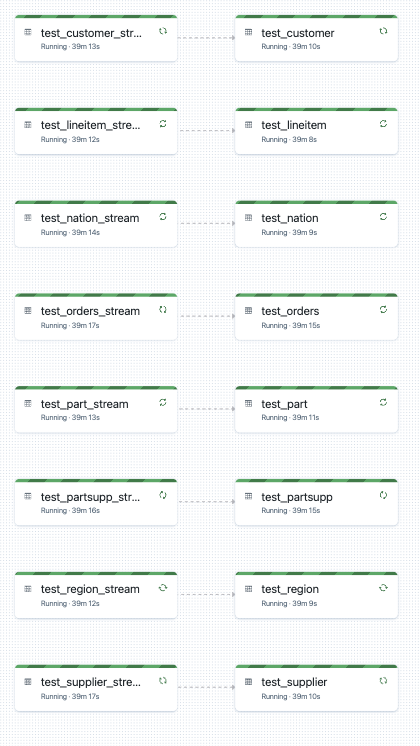

# Snowflake Stream Reader


The Snowflake Spark connector is a great option for reading from and writing data to Snowflake, however, for larger data sizes it can be a bottlenext. It is recommended that for larger data sizes that users instead initial copy to an external stage from Snowflake as files, then use Databricks Auto Loader to read the staged files. This process helps automate this process by setting up CDC streams. If datasets are smaller then full table copies could be more simple.  

The goal of this notebook is to create a "stream" of CDC changes out of Snowflake to cloud storage. It will provide at most two tables:
1. Append only Delta table of CDC changes 
    - Please note that we add `load_datetime` to the published files so that we can drop duplicate changes across files  
1. Delta table that maintains current state using merge keys  
    - Merging the data from a CDC will replicate Snowflake tables to Delta Lake and will keep the tables consistent. 
    - Snowflake Task latency will control the lag between Snowflake and Delta.  


There is a sample [Delta Live Table pipeline notebook](src/DLT_Pipeline.py), this will complete automate the ingestion process from cloud storage to delta tables that can be accessed as users wish. The DLT pipeline looks something like the following: 


<div style="text-align:center"> </div>


## Usage Notes  

This is not a streaming solution and should not be advised as "good" architecture. This is help alliviate the pain of trying to load data out of Snowflake in a scalable and repeatable fashion. This should be considered a solution when re-architecting the data ingestion and data etl process is not up for negotiation but there is a desire to improve the advanced analytics development experience. 

- This process is set at the schema level, which means that you will need to have different stages and file formats for each schema you are accessing. 
- By default streams will be named `<table_name>_stream`
- By default tasks will be named `<table_name>_stream_task`
- Frequency of data loads:  
  - If you are unloading data out of Snowflake frequently (less than 10 minutes) it is likely best to run your Auto Loader stream 24/7 or use DLT. 
  - Less frequent unloading of data from Snowflake can likely be scheduled using `.trigger(once=True)`. If you do this you will want to try and align this with your Snowflake unload but it will be difficult to perfectly time it. For example, if data is loaded every 30 minutes (1:00, 1:30, ... 3:30,...) then maybe you want to schedule the Databricks job to run five minutes after (1:05, 1:35,...)  
- This method reduces the total cost of reading data from Snowflake so that it can be used by other tools like Databricks.  
  - Spark connector acquires a double spend (Databricks and Snowflake) and this method is only Snowflake 
  - Other methods may require each user to read the data (i.e. a team of 10 people are reading the same base tables in Snowflake) which means that not only are individuals re-reading data but the entire team is duplicating this effort. Getting data out of Snowflake and into ADLS reduces the number of reads on a table to 1.   

 
## Using a Configuration File   

Using this framework, engineers can easily create namespace and table objects. The namespace object (`SnowflakeNamespace`) can have a collection of table objects (`SnowflakeTable`). To streamline and make this a more simple process, users can provide a json configuration file that looks like the example below. You will notice that many of the parameters to the database object are provided via widgets in this notebook.   

Required Parameters:
- snowflake_database: the database to which namespace objects (file format, stages, etc) are created in. 
- snowflake_schema: the schema to which namespace objects (file format, stages, etc) are created in. 
- stage_name: created if it does not exist 
- file_format_name: created if does not exist 
- file_format_type: must be `json` at this time. 
- tables

Optional Namespace Parameters: 
- s3_bucket: aws only
- storage_account_name: azure only
- container_name: azure only
- sas_token: optional and azure only
- storage_integration: required for aws and optional for azure. If provided then this will be used over the sas_token. 
- additional_path: path suffix for sub-directorys in the bucket/container 

Optional Table Parameters:
- enabled: default to true 
- merge_keys: if they are not provided then append only streams are supported but not able to perform merges 

```json
{
    "snowflake_database":"my_database",
    "snowflake_schema": "my_schema",
    "stage_name": "my_snowflake_stage_name",
    "s3_bucket": "my_bucket_name",
    "storage_account_name": "myadlsgen2", 
    "container_name": "mystoragecontainer",
    "additional_path": "/my/dir/in/adls",
    "sas_token": "storage_sas_token",
    "storage_integration": "name_of_existing_storage_integration",
    "file_format_name": "my_snowflake_file_format_name",
    "file_format_type": "json",
    "tables": [
        {
            "database_name":"my_database",
            "schema_name":"my_schema",
            "table_name": "table_name",
            "merge_keys": ["id"],
            "task_schedule": "1 MINUTE",
            "task_warehouse_size": "XSMALL",
            "enabled": true
        },
        {
            "database_name":"my_database",
            "schema_name":"my_schema",
            "name": "table_name2",
            "merge_keys": ["id"],
            "task_schedule": "1 MINUTE",
            "task_warehouse_size": "SMALL",
            "enabled": false
        },
        {
            "database_name":"my_database",
            "schema_name":"my_schema",
            "name": "table_name3",
            "merge_keys": ["id"],
            "task_schedule": "5 MINUTE",
            "task_warehouse_size": "XSMALL",
            "enabled": true
        }
    ]
}
```

### Data Layout

The layout of data in cloud storage is pre-determined and is parameterized by the user. In this examples we will use an Azure storage account, it is important to note that S3 and GCS will map to the container in Azure.  

Data is published in the following format: 
- Storage Account Name: `storage_account_name`
- Container Name: `container_name`
- Additional Path: `/my/dir/`
- Snowflake Table: `my_database.my_schema.my_table`
- Published Location: `abfss://container_name@storage_account_name.dfs.core.windows.net/my/dir/my_database/my_schema/my_table/year=yyyy/month=mm/day=dd`.
  - The year, month, and day directories are set by the datetime when unloading the data. This is currently not configurable. 


## Snowflake SQL Example Code 

NOTE - using this repository can help orchstrate and automate this process when given a configuration file.  

In order to "stream" data efficiently out of Snowflake we will need to leverage some of Snowflake's CDC capabilities. This requires creating objects in Snowflake that unload data as files to cloud storage. Once in cloud storage we (Databricks) can use Auto Loader to read the files and write them to Delta. Auto Loader can be used as a DLT Pipeline (which I will **not** be showing here) or the Structured Streaming APIs (which I **will** be showing in this notebook).   

Assuming that you are implementing this process for many tables, this notebook can be used to complete the following **one** time:   
- Create a Snowflake `FILE FORMAT` of type `JSON`   
- Create a Snowflake `STAGE` using the `FILE FORMAT` and a Azure Storage SAS token 

For **each table** you want to load this notebook can be used to complete the following:  
- Create a Snowflake `STREAM` for your table (`<table_name>_stream`)    
- Create a Snowflake `TASK` to copy CDC data to ADLS Gen2 as json files (`<table_name>_stream_task`)    

```sql
---- SET UP FOR ALL TABLES ----

-- Create Database
CREATE DATABASE IF NOT EXISTS <NAME OF YOUR SNOWFLAKE DATABASE>;
USE DATABASE <NAME OF YOUR SNOWFLAKE DATABASE>;
-- Create Schema 
CREATE SCHEMA IF NOT EXISTS <NAME OF YOUR SNOWFLAKE SCHEMA>;
USE SCHEMA <NAME OF YOUR SNOWFLAKE SCHEMA>;

-- Create a json file format to unload data 
CREATE OR REPLACE FILE FORMAT <NAME OF YOUR FILE FORMAT> 
TYPE = JSON;

-- Create an external stage - this is where I will unload data 
CREATE OR REPLACE STAGE <NAME OF YOUR STAGE>
URL = 'azure://<account>.blob.core.windows.net/<container>'
CREDENTIALS = (AZURE_SAS_TOKEN = '<SAS TOKEN>')
FILE_FORMAT = <NAME OF YOUR FILE FORMAT>
;


---- SET UP FOR EACH TABLE ---- 

-- Create a snowflake stream
CREATE OR REPLACE STREAM <NAME OF YOUR STREAM>
ON TABLE <NAME OF YOUR TABLE> 
APPEND_ONLY = FALSE -- gives updates and deletes
SHOW_INITIAL_ROWS = TRUE ; -- for the initial rows for the first pull then only new/updated rows 

-- Create a task that runs every minute 
CREATE OR REPLACE TASK <NAME OF YOUR TASK> 
SCHEDULE = '1 MINUTE' -- Change as needed 
ALLOW_OVERLAPPING_EXECUTION = FALSE -- if they overlap then we may get duplicates from the stream if the previous DML is not complete 
USER_TASK_MANAGED_INITIAL_WAREHOUSE_SIZE = 'XSMALL' -- using Snowflake Serverless compute 
AS 
(
  COPY INTO @<NAME OF YOUR STAGE>/<STORAGE DIR>/
  FROM (
      SELECT OBJECT_CONSTRUCT(*) as row_value FROM (SELECT *, current_timestamp() as load_datetime FROM {table_name}_stream )
      )
  include_query_id=true;  -- Ensures that each file we write has a unique name which is required for auto loader  
)

```


## Limitations 

- Only supports Azure Data Lake Storage Gen2 as the external stage  
- Only supports servless tasks in Snowflake 
- Not all updates to a row are provided but the most recent updates are  
  - Snowflake streams do not provide every transaction that occurs on the row, only the previous record from the last used offset and the most recent version of the record.  
  - For example, if a row is updated multiple times in between executions then only the last change is provided  
  - If this is unacceptable then users can use a `changes` clause which will allow users to manually implement CDC operations between table versions in Snowflake, but please note that the offsets are not managed by Snowflake.   
- Custom naming of tasks and streams is not supported. All streams will have `<table_name>_stream` and all tasks will have `<table_name>_stream_task`  


## Development 
Please submit feature requests and issues through github. 
